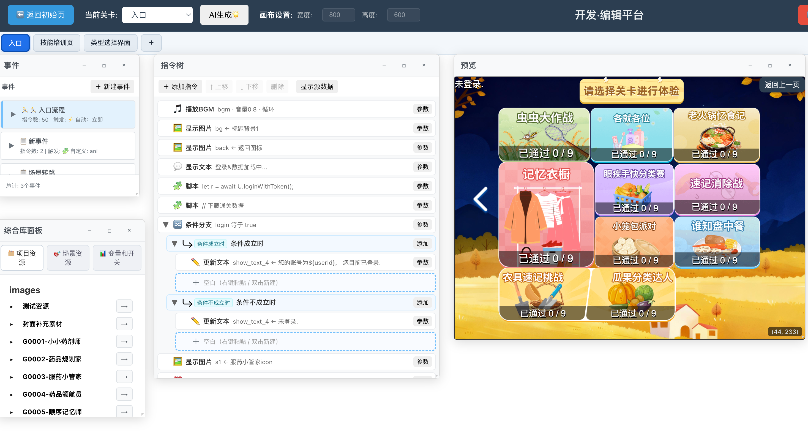
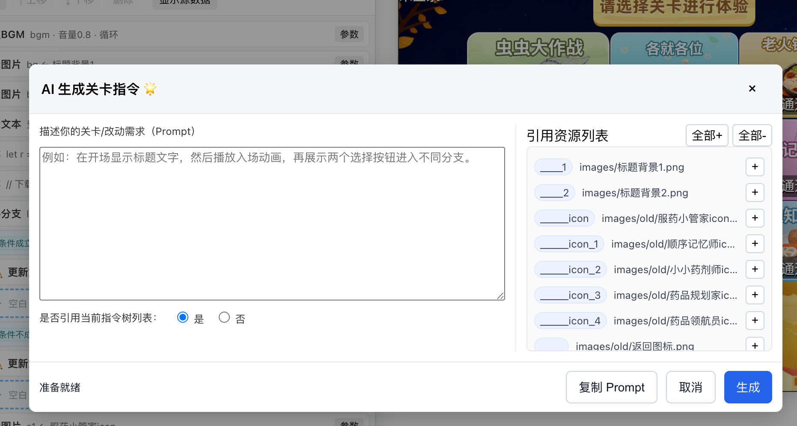

# Vibe Game Engine

我从零做了这套 2D 游戏引擎和 Web 编辑器，想解决的是“做一个能马上试玩的小游戏，为什么还得从头写一堆业务代码”这件事。这里的场景、资源、事件和指令都是可运行的 JSON：需要扩展时我可以继续写代码，做内容时也可以直接在浏览器里把关卡搭出来。

编辑器是我实际用来做游戏的工具。可以把图片、音频和动画放进画面，用指令树把出现、移动、播放、点击、拖拽、条件和事件接起来，右边马上就能试玩。答题、选项、拖放到目标区域、过关这类常见流程，不需要先写脚本再反复刷新页面。

我也把 AI 关卡生成做进了编辑器：它能看到当前画布、已有指令和可用资源，生成可以直接写回关卡的 `commands + extra_events`。为了不让它只会“看起来像 JSON”，我用中文需求到指令 JSON 的审计数据训练配套模型，并让每条数据经过资源、依赖关系和真实运行时检查；我更在意它生成后能不能跑，而不是只把回答写得像样。

## 在线使用

- [在线编辑器](https://wukangmh2022-cmyk.github.io/vibe-game-engine/editor/)
  打开本地项目文件夹后即可编辑场景、资源和事件。工程会保存在浏览器缓存或用户授权的本地文件夹中，可在之后继续开发，并随时导出完整 `project.zip`。
- [智慧健脑客户示例](https://wukangmh2022-cmyk.github.io/vibe-game-engine/)
  面向客户的静态试玩版，已移除登录、账号、进度同步和分数上传。

## AI 生成关卡

编辑器的 AI 面板将关卡需求、画布尺寸、当前指令树和已选资源整理为符合引擎规范的提示词。填写自己的 OpenRouter API Key 后，可直接生成可写入关卡的 `commands` JSON；密钥只保存在当前浏览器，不会提交到项目或 GitHub Pages。生成结果仍可在指令树中逐条调整，并立刻在右侧 Pixi 画布预览。

典型流程：描述玩法 -> 选择要引用的图片、音频或动画资源 -> 生成关卡指令 -> 在预览中验证 -> 保存或导出工程。

## 指令模型实验

仓库包含一条面向本引擎 DSL 的可复现实验链路：先合成并严格验证“需求 -> 指令 JSON”数据，再以 QLoRA 微调开源基础模型，最后在固定题集上比较 Base 与 Adapter。第一阶段的目标是提高引擎指令、资源引用和短组合逻辑的正确率，不是直接训练完整 10 关游戏规划。

完整说明与脚本在 [training/README.md](training/README.md)，分为 `agent-debugger/`、`training/qlora/` 和 `training/eval/` 三部分。关于 15 个已试玩人类关卡、一期多 worker 队列合成、二期跨事件补齐与三期浏览器互动补齐，见 [训练数据合成策略](docs/data-synthesis-strategy.md)。

可直接查看最终训练视图的 [可读指令大纲（V4）](docs/training-data/level-authoring-sft-v4-command-outline.txt)。它展示中文需求、主流程和事件中的指令顺序，便于理解训练/验证样本形态；不包含原始 JSON、资源目录、命令参数或完整嵌套配置。

### 数据合成与质量门

输入是 `customer-demo/scene/**/*.json` 中的真实场景、关卡、资源和指令。`agent-debugger/build_command_db.py` 将其拆为只读 SQLite 索引，教师模型只能通过工具按需取得：指令契约、真实指令示例、相邻指令上下文，以及某关卡的真实资源清单。模型自主调用工具、生成候选、请求验证；最多 20 个工具动作，达到上限后控制器强制它输出一次最终 JSON。

原始一期 `corpus.jsonl` 是采集记录；训练使用统一视图 `training-data/level-authoring-sft-v1.jsonl`。每条训练记录的输出都使用同一事件感知结构：

```json
{
  "schema_version": "vibe-level-authoring-sft-v1",
  "sample_id": "phase1-g0000",
  "source_dataset": "command-agent-sft-v1|event-coordination-sft-v2",
  "input": {
    "intent": "中文关卡功能需求",
    "asset_catalog": [{"id":"真实资源ID","type":"image","path":"相对项目路径","origin":"existing","exists":true}]
  },
  "output": {
    "commands": [{"id":"...","type":"SHOW_IMAGE","parameters":{}}],
    "extra_events": []
  }
}
```

这不是仅靠 JSON schema 的筛选。写入训练集前必须全部通过：真实资源 `id/type/path` 与关卡元数据一致且磁盘文件存在；资源不能是 `virtual://` 或猜测路径；元素更新命令必须先创建同一元素；`BREAK` 必须在 `LOOP.commands`；一期指令通过仓库实际 `CommandExecutor` 配合内存状态、资源、渲染和音频适配器预跑。三期浏览器/Pixi 互动指令使用真实 handler 参数、真实资源和元素依赖的静态契约验证后直接纳入训练；浏览器回放后置，不作为当前数据入库阻塞条件。

首批采样保持 `72%` 单指令 atomic 与 `28%` 2-4 指令 motif。启动合成器时使用新的兼容 API：

```bash
export VIBE_TEACHER_API_BASE=http://HOST/v1
export VIBE_TEACHER_API_KEY=your-key
export VIBE_TEACHER_MODEL=teacher-model-id

python3 agent-debugger/command_synthesize.py \
  --samples 100 --workers 4 --max-actions 20 --timeout 180
```

### QLoRA 微调

训练输入只取统一视图中已审计通过的记录。`training/qlora/prepare_data.py` 去重并固定随机划分训练/验证集，产出 chat-format JSONL：system 为引擎输出约束，user 为中文需求与可用资源，assistant 仅为 `intent + asset_catalog + commands + extra_events` JSON。普通单事件样本必须输出 `extra_events: []`；跨事件样本输出完整 EventConfig 数组。教师工具轨迹和长推理不会作为监督标签，避免把不稳定的检索过程蒸馏进模型。

第一版选单卡 4-bit NF4 QLoRA，而不是全量微调：27B 密集模型全参数训练需要远超单张 4090 的显存和优化器状态；QLoRA 只训练低秩 adapter，可在 4090 级卡上进行可控实验、保存体积小，并能用同一基础模型公平比较 Base 与 Adapter。默认值为 `r=32`、`alpha=64`、最大长度 `3072`、batch `1`、梯度累积 `16`、学习率 `1e-4`、3 epoch。显存不足先降 max length 到 2048，再降 r 到 16。

```bash
pip install -r training/qlora/requirements.txt
python training/qlora/prepare_data.py \
  --input training-data/level-authoring-sft-v1.jsonl \
  --output-dir training/qlora/data/level-authoring-sft-v1

python training/qlora/train_qlora.py \
  --model-name-or-path /root/autodl-tmp/Qwen-model \
  --data-dir training/qlora/data/level-authoring-sft-v1 \
  --output-dir training/qlora/outputs/vibe-level-authoring-qlora
```

训练产物是 PEFT adapter，不是完整基础模型。发布时应上传 adapter、tokenizer、训练配置、数据 manifest 和评估报告；基础模型保持引用原始模型名，避免在 GitHub 仓库提交几十 GB 权重。

### 固定评估

[training/eval/cases/command_benchmark_v1.json](training/eval/cases/command_benchmark_v1.json) 是人工编写、版本化的 36 个固定短指令题；[level_module_benchmark_v1.json](training/eval/cases/level_module_benchmark_v1.json) 额外包含 12 个完整关卡功能块题。它们使用 `customer-demo` 的资源目录，而该目录属于训练来源范围，因此只作为运行时回归 smoke test，不作为最终泛化结论。API 只负责让 Base 和 Adapter 回答同一题，不参与生成或改写测试 query。

评估器以 6-12 并发运行，默认 8 并发；每个输出都执行 JSON 提取、主指令/命令数检查、资源契约、依赖顺序和 `CommandExecutor` 预跑。先用机器评分筛掉结构或运行时错误，再从 Base/Adapter 通过与失败的差异案例中抽样导入编辑器试玩，人工仅记录需求满足和交互完成；文案与布局不属于当前训练目标。

交互与跨事件能力使用独立的 [heldout_interaction_benchmark_v3.py](training/eval/heldout_interaction_benchmark_v3.py) 单独评分。它包含 80 条从零设计的 held-out 题，不读取训练语料、不复用训练资源或训练场景；其中 10 条为包含 6 段“然后”逻辑、多个事件和条件分支的复杂协调题。oracle 定义真实 pointer 点击/拖拽、信号输入和状态断言。评估器执行 `commands + extra_events` 的完整关卡后量化结构通过、运行时通过和交互完成率；不评判布局或审美。

```bash
python training/eval/run_eval.py \
  --profile qwen36_27b \
  --profile adapter \
  --workers 8

python training/eval/run_eval.py \
  --cases training/eval/cases/level_module_benchmark_v1.json \
  --profile qwen36_27b \
  --profile adapter \
  --workers 8

python training/eval/run_interaction_eval.py \
  --profile qwen36_27b \
  --profile adapter \
  --workers 8
```

训练完成后用 `training/eval/report.py` 输出下表的实际数值：

| 模型 | 短指令通过/36 | 功能块通过/12 | 运行时预跑通过 | 平均响应秒数 | 训练数据版本 |
| --- | ---: | ---: | ---: | ---: | --- |
| Base | 待填 | 待填 | 待填 | 待填 | - |
| QLoRA Adapter | 待填 | 待填 | 待填 | 待填 | level-authoring-sft-v1 |

完整关卡/十关试玩是第二阶段评估：需要先积累经过浏览器运行时验证的长轨迹数据，不能用本阶段的短指令语料强行衡量整关策划能力。

## 功能概览

- 自动组织资源：读取项目资源、类型、路径和图片尺寸，降低资源引用错误。
- 指令化游戏逻辑：通过 `show_text`、`show_image`、`show_button`、`show_choices`、`set_variable`、`if_condition`、`loop`、`scene_redirect` 等指令组织玩法。
- 可视化编辑器：提供项目首页、场景列表、命令树、事件面板、变量/开关管理、资源选择和 Pixi 预览画布。
- 运行时预览：同一份 JSON 可在编辑器中预览，也可通过独立 runtime 页面运行。
- 事件和交互：支持按钮、选择项、拖拽、区域检测、条件分支、变量状态和场景跳转。
- RPG 图片地图：主分支包含实验性图片地图、角色移动、碰撞遮罩和前景遮挡层，详见 [RPG 图片地图运行时](docs/rpg-image-map-runtime.md)。

## Screenshots

### 可视化关卡编辑



### AI 生成关卡指令



## 技术栈

- TypeScript
- React
- PixiJS runtime/editor integration
- Webpack editor build
- Jest + ts-jest
- AJV schema validation
- EventEmitter3

## 工程结构

```text
src/
├── core/                       # GameRuntime、CommandExecutor、状态、事件、资源管理
├── commands/                   # 通用命令处理器
├── browser/                    # Pixi 浏览器渲染与交互处理器
├── handlers/                   # 拖拽、区域检测等扩展处理器
└── types/                      # 运行时类型定义

level-editor/
├── src/App.tsx                 # 编辑器主界面
├── src/components/             # 命令、事件、变量、资源、AI 生成等面板
├── src/runtime/                # 编辑器内 Pixi 预览运行时
└── public/                     # 编辑器和 runtime HTML 模板
```

## 本地开发

```bash
npm install
npm run build
npm start
```

## GitHub Pages 发布

`customer-demo/` 是智慧健脑的静态客户版本，默认进入健脑训练菜单，全部本地关卡可用，且不含登录、账号、进度同步和分数上传指令。GitHub Actions 会在 `main` 每次推送后构建客户示例与在线编辑器，并发布到 GitHub Pages。

本地构建 Pages 产物：

```bash
npm run build:customer-demo
```

产物位于 `gh-pages/`，部署工作流见 `.github/workflows/deploy-customer-demo.yml`。首次启用时，请在仓库 Settings 的 **Pages > Build and deployment** 中选择 **GitHub Actions**。
