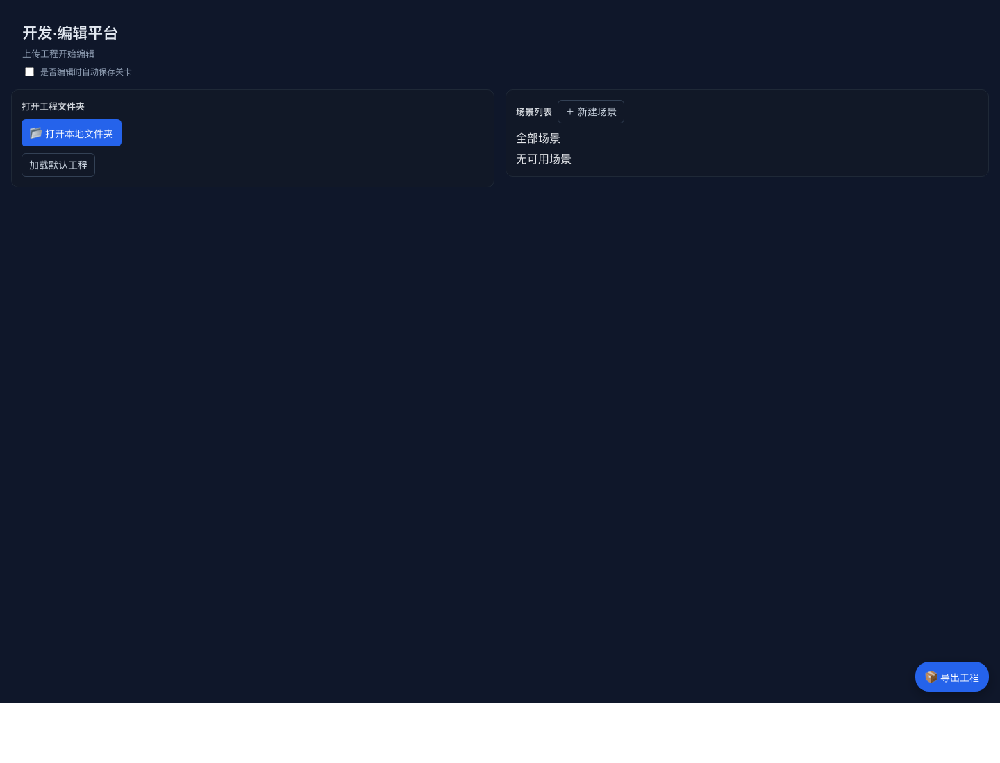

# Vibe Game Engine

Vibe Game Engine 是一个数据驱动的 2D 游戏运行时和 Web 关卡编辑器。它把游戏拆成 JSON 场景、资源、事件和指令，让游戏内容可以由编辑器、AI 或配置文件组织，而不是写死在业务代码里。

## 项目亮点

- AI 生成关卡：编辑器内置 AI 生成入口，可把用户需求、当前指令、已选图片/音频资源和画布尺寸组合成提示，让 AI 输出可执行的 `commands` JSON。
- 自动组织资源：编辑器会读取项目资源、资源类型、路径和图片尺寸，并把这些上下文提供给 AI，降低资源引用错误。
- 指令化游戏逻辑：通过 `show_text`、`show_image`、`show_button`、`show_choices`、`set_variable`、`if_condition`、`loop`、`scene_redirect` 等指令组织玩法。
- 可视化编辑器：提供项目首页、场景列表、命令树、事件面板、变量/开关管理、资源选择和 Pixi 预览画布。
- 运行时预览：同一份 JSON 可在编辑器中预览，也可通过独立 runtime 页面运行。
- 事件和交互：支持按钮、选择项、拖拽、区域检测、条件分支、变量状态和场景跳转，适合快速制作互动小游戏。
- 可扩展架构：核心运行时、浏览器 Pixi 渲染层和编辑器 UI 分离，便于继续扩展新指令和新渲染能力。

在线示例：[http://47.108.203.64/new/runtime.html](http://47.108.203.64/new/runtime.html)

## Screenshots



## Tech Stack

- TypeScript
- React
- PixiJS runtime/editor integration
- Webpack editor build
- Jest + ts-jest
- AJV schema validation
- EventEmitter3

## Project Structure

```text
src/
├── core/                       # GameRuntime、CommandExecutor、状态、事件、资源管理
├── commands/                   # 通用命令处理器
├── browser/                    # Pixi 浏览器渲染与交互处理器
├── handlers/                   # 拖拽、区域检测等扩展处理器
└── types/                      # 运行时类型定义

level-editor/
├── src/App.tsx                 # 编辑器主界面
├── src/components/             # 命令、事件、变量、资源、AI 生成等面板
├── src/runtime/                # 编辑器内 Pixi 预览运行时
└── public/                     # 编辑器和 runtime HTML 模板
```

## Getting Started

```bash
npm install
npm run build
npm start
```

## Customer Demo On GitHub Pages

The `customer-demo/` project is the static, customer-safe edition of the 智慧健脑 games. It starts at the medicine-training game menu, enables every local level, and omits login, account, progress-sync, and score-upload commands.

[在线试玩智慧健脑](https://wukangmh2022-cmyk.github.io/vibe-game-engine/)

Build the Pages artifact locally with:

```bash
npm run build:customer-demo
```

The generated site is `gh-pages/`. The GitHub Actions workflow in `.github/workflows/deploy-customer-demo.yml` publishes that directory whenever `main` is pushed. In the repository Settings, select **Pages > Build and deployment > GitHub Actions** once to enable the first deployment.
## RPG Image-Map Runtime

Experimental RPG support lives on the `rpg` branch. It adds full-image map rendering, RPG actors, simple movement, passability-mask sampling, overlay light/occlusion layers, and a browser debug API.

See [docs/rpg-image-map-runtime.md](docs/rpg-image-map-runtime.md).
