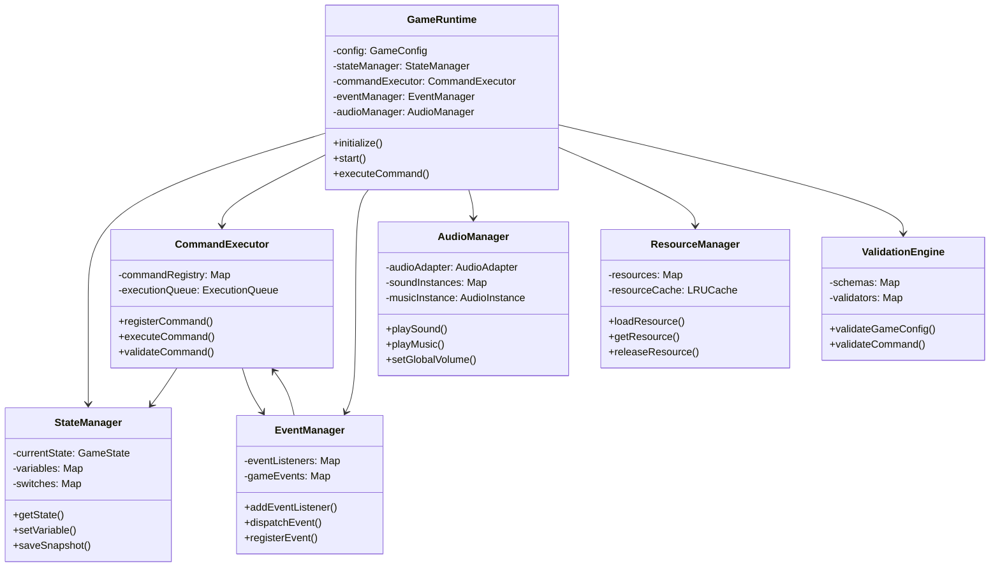

# 运行时核心类架构设计

## 架构概述

基于数据驱动指令系统的运行时引擎采用分层架构设计，确保各组件职责清晰、松耦合、高内聚。

```
┌─────────────────────────────────────────────────────────┐
│                    Game Runtime                         │
│  ┌─────────────┐  ┌─────────────┐  ┌─────────────┐    │
│  │   Event     │  │  Command    │  │   State     │    │
│  │  Manager    │  │  Executor   │  │  Manager    │    │
│  └─────────────┘  └─────────────┘  └─────────────┘    │
│  ┌─────────────┐  ┌─────────────┐  ┌─────────────┐    │
│  │  Resource   │  │ Validation  │  │   Logger    │    │
│  │  Manager    │  │   Engine    │  │  Service    │    │
│  └─────────────┘  └─────────────┘  └─────────────┘    │
└─────────────────────────────────────────────────────────┘
```

## 核心类设计

### 1. 技术栈集成层

为确保与现有CAGamePage基类兼容，运行时引擎提供技术栈适配层：

```typescript
// 技术栈适配接口
interface TechStackAdapter {
  // 渲染引擎适配（支持PIXI.js、Canvas、DOM等）
  createRenderer(type: 'pixi' | 'canvas' | 'dom'): RenderAdapter;
  // 音频引擎适配
  createAudioManager(): AudioAdapter;
  // 输入管理适配
  createInputManager(): InputAdapter;
}

// 渲染适配器接口
interface RenderAdapter {
  createSprite(texture: string): any;
  createText(content: string, style?: any): any;
  setPosition(element: any, x: number, y: number): void;
  setScale(element: any, scale: number): void;
  setVisible(element: any, visible: boolean): void;
}

// 音频适配器接口
interface AudioAdapter {
  playSound(id: string, options?: AudioOptions): void;
  playMusic(id: string, options?: AudioOptions): void;
  stopSound(id: string): void;
  stopMusic(): void;
  setVolume(volume: number): void;
}

// CAGamePage集成适配器
class CAGamePageAdapter {
  private runtime: GameRuntime;
  
  constructor(runtime: GameRuntime) {
    this.runtime = runtime;
  }
  
  // 映射CAGamePage生命周期到运行时引擎
  gameInit(options: { level: number }): void { 
    this.runtime.initialize();
    this.runtime.loadLevel({ level: options.level });
  }
  gameStart(): void { this.runtime.start(); }
  gameReset(): void { this.runtime.reset(); }
  gameOver(): void { this.runtime.gameOver(); }
  gameExit(): void { this.runtime.stop(); }
  gameNext(): void { this.runtime.nextLevel(); }
}
```

### 2. GameRuntime - 主引擎类

```typescript
/**
 * 游戏运行时主引擎
 * 负责协调各个子系统，提供统一的游戏运行接口
 */
class GameRuntime {
  private config: GameConfig;
  private stateManager: StateManager;
  private commandExecutor: CommandExecutor;
  private eventManager: EventManager;
  private resourceManager: ResourceManager;
  private validationEngine: ValidationEngine;
  private logger: LoggerService;
  private techAdapter: TechStackAdapter;
  private audioManager: AudioManager;
  
  private isRunning: boolean = false;
  private currentLevel: number = 1;
  private gameLoop: GameLoop;
  
  constructor(config: GameConfig, adapter?: TechStackAdapter) {
    this.config = config;
    this.techAdapter = adapter || new DefaultTechStackAdapter();
    this.initializeSubsystems();
  }
  
  private initializeSubsystems(): void {
    this.stateManager = new StateManager(this.config);
    this.eventManager = new EventManager();
    this.resourceManager = new ResourceManager();
    this.validationEngine = new ValidationEngine();
    this.commandExecutor = new CommandExecutor(this.stateManager, this.eventManager);
    this.logger = new LoggerService();
    this.gameLoop = new GameLoop();
  }
  
  // 生命周期管理
  async initialize(): Promise<void>;
  async start(): Promise<void>;
  async pause(): Promise<void>;
  async resume(): Promise<void>;
  async stop(): Promise<void>;
  async destroy(): Promise<void>;
  
  // 游戏控制
  async loadLevel(levelConfig: LevelConfig | { level: number }): Promise<void>;
  async nextLevel(): Promise<void>;
  async restartLevel(): Promise<void>;
  async reset(): Promise<void>;
  async gameOver(): Promise<void>;
  async saveGame(): Promise<GameSaveData>;
  async loadGame(saveData: GameSaveData): Promise<void>;
  
  // 指令执行
  async executeCommand(command: GameCommand): Promise<CommandResult>;
  async executeCommandSequence(commands: GameCommand[]): Promise<CommandResult[]>;
  
  // 事件处理
  addEventListener(eventType: string, handler: EventHandler): void;
  removeEventListener(eventType: string, handler: EventHandler): void;
  dispatchEvent(event: GameEvent): void;
  
  // 状态访问
  getGameState(): GameState;
  getCurrentLevel(): LevelConfig;
  getVariable(name: string): any;
  setVariable(name: string, value: any): void;
  getSwitch(name: string): boolean;
  setSwitch(name: string, value: boolean): void;
  
  // 私有方法
  private initializeSubsystems(): void;
  private setupGameLoop(): void;
  private handleError(error: Error): void;
}
```

### 3. StateManager - 状态管理器

```typescript
/**
 * 游戏状态管理器
 * 负责游戏状态的创建、更新、查询和持久化
 */
class StateManager {
  private currentState: GameState;
  private stateHistory: StateSnapshot[];
  private variables: Map<string, any>;
  private switches: Map<string, boolean>;
  private maxHistorySize: number = 100;
  
  constructor(initialConfig: GameConfig) {
    this.initializeState(initialConfig);
  }
  
  // 状态初始化
  initializeState(config: GameConfig): void;
  resetState(): void;
  resetToLevel(level: number): void;
  
  // 状态操作
  updateState(changes: StateChange[]): void;
  getState(): GameState;
  cloneState(): GameState;
  
  // 变量管理
  setVariable(name: string, value: any): void;
  getVariable(name: string): any;
  hasVariable(name: string): boolean;
  deleteVariable(name: string): void;
  getAllVariables(): Record<string, any>;
  
  // 开关管理
  setSwitch(name: string, value: boolean): void;
  getSwitch(name: string): boolean;
  toggleSwitch(name: string): void;
  getAllSwitches(): Record<string, boolean>;
  
  // 历史管理
  saveSnapshot(description?: string): string;
  restoreSnapshot(snapshotId: string): boolean;
  getSnapshotHistory(): StateSnapshot[];
  clearHistory(): void;
  
  // 序列化
  serialize(): string;
  deserialize(data: string): void;
  
  // 事件
  onStateChange(callback: StateChangeCallback): void;
  offStateChange(callback: StateChangeCallback): void;
  
  private notifyStateChange(changes: StateChange[]): void;
  private validateStateChange(change: StateChange): boolean;
}
```

### 4. CommandExecutor - 指令执行器

```typescript
/**
 * 指令执行器
 * 负责指令的注册、解析、验证和执行
 */
class CommandExecutor {
  private commandRegistry: Map<string, CommandHandler>;
  private executionQueue: ExecutionQueue;
  private context: CommandContext;
  private isExecuting: boolean = false;
  
  constructor(stateManager: StateManager, eventManager: EventManager) {
    this.context = new CommandContext(stateManager, eventManager);
    this.executionQueue = new ExecutionQueue();
    this.registerBuiltinCommands();
  }
  
  // 指令注册
  registerCommand(type: string, handler: CommandHandler): void;
  unregisterCommand(type: string): void;
  hasCommand(type: string): boolean;
  getRegisteredCommands(): string[];
  
  // 指令执行
  async executeCommand(command: GameCommand): Promise<CommandResult>;
  async executeCommandSequence(commands: GameCommand[]): Promise<CommandResult[]>;
  async executeCommandParallel(commands: GameCommand[]): Promise<CommandResult[]>;
  
  // 队列管理
  queueCommand(command: GameCommand): void;
  queueCommandSequence(commands: GameCommand[]): void;
  clearQueue(): void;
  pauseExecution(): void;
  resumeExecution(): void;
  
  // 条件执行
  async executeConditional(command: ConditionalCommand): Promise<CommandResult>;
  async executeLoop(command: LoopCommand): Promise<CommandResult>;
  
  // 验证
  validateCommand(command: GameCommand): ValidationResult;
  validateCommandSequence(commands: GameCommand[]): ValidationResult;
  
  // 私有方法
  private registerBuiltinCommands(): void {
    // 状态控制指令
    this.registerCommand('set_variable', new SetVariableHandler());
    this.registerCommand('set_switch', new SetSwitchHandler());
    
    // 流程控制指令
    this.registerCommand('wait', new WaitHandler());
    this.registerCommand('jump_to', new JumpToHandler());
    this.registerCommand('call_event', new CallEventHandler());
    
    // 条件分支指令
    this.registerCommand('if_condition', new IfConditionHandler());
    this.registerCommand('loop', new LoopHandler());
    
    // 显示控制指令
    this.registerCommand('show_image', new ShowImageHandler());
    this.registerCommand('show_text', new ShowTextHandler());
    this.registerCommand('hide_image', new HideImageHandler());
    this.registerCommand('hide_text', new HideTextHandler());
    
    // 移动动画指令
    this.registerCommand('move_to', new MoveToHandler());
    this.registerCommand('scale_to', new ScaleToHandler());
    this.registerCommand('rotate_to', new RotateToHandler());
    
    // 音频控制指令
    this.registerCommand('play_sound', new PlaySoundHandler());
    this.registerCommand('play_music', new PlayMusicHandler());
    this.registerCommand('stop_sound', new StopSoundHandler());
    this.registerCommand('stop_music', new StopMusicHandler());
    
    // 用户交互指令
    this.registerCommand('enable_click', new EnableClickHandler());
    this.registerCommand('show_choices', new ShowChoicesHandler());
    
    // 元素交互指令
    this.registerCommand('set_draggable', new SetDraggableHandler());
    this.registerCommand('set_clickable', new SetClickableHandler());
    this.registerCommand('set_droppable', new SetDroppableHandler());
    this.registerCommand('check_drop_zone', new CheckDropZoneHandler());
    
    // 位置控制指令
    this.registerCommand('set_position', new SetPositionHandler());
    this.registerCommand('get_position', new GetPositionHandler());
    this.registerCommand('check_collision', new CheckCollisionHandler());
    this.registerCommand('check_in_area', new CheckInAreaHandler());
    
    // 特效动画指令
    this.registerCommand('fade_in', new FadeInHandler());
    this.registerCommand('fade_out', new FadeOutHandler());
    this.registerCommand('shake', new ShakeHandler());
    
    // 游戏逻辑指令
    this.registerCommand('check_answer', new CheckAnswerHandler());
    this.registerCommand('add_score', new AddScoreHandler());
    this.registerCommand('next_level', new NextLevelHandler());
    this.registerCommand('game_over', new GameOverHandler());
  }
  private createExecutionContext(command: GameCommand): CommandExecutionContext;
  private handleCommandError(command: GameCommand, error: Error): CommandResult;
  private logCommandExecution(command: GameCommand, result: CommandResult): void;
}
```

### 5. EventManager - 事件管理器

```typescript
/**
 * 事件管理器
 * 负责事件的注册、触发、监听和生命周期管理
 */
class EventManager {
  private eventListeners: Map<string, EventListener[]>;
  private eventQueue: EventQueue;
  private gameEvents: Map<string, GameEvent>;
  private triggerConditions: Map<string, TriggerCondition>;
  
  constructor() {
    this.eventListeners = new Map();
    this.eventQueue = new EventQueue();
    this.gameEvents = new Map();
    this.triggerConditions = new Map();
  }
  
  // 事件注册
  registerEvent(event: GameEvent): void;
  unregisterEvent(eventId: string): void;
  getEvent(eventId: string): GameEvent | undefined;
  getAllEvents(): GameEvent[];
  
  // 监听器管理
  addEventListener(eventType: string, listener: EventListener): void;
  removeEventListener(eventType: string, listener: EventListener): void;
  removeAllListeners(eventType?: string): void;
  
  // 事件触发
  dispatchEvent(eventType: string, data?: any): void;
  dispatchEventAsync(eventType: string, data?: any): Promise<void>;
  queueEvent(eventType: string, data?: any, delay?: number): void;
  
  // 触发条件
  registerTrigger(triggerId: string, condition: TriggerCondition): void;
  checkTriggers(context: TriggerContext): string[];
  enableTrigger(triggerId: string): void;
  disableTrigger(triggerId: string): void;
  
  // 事件处理
  processEventQueue(): void;
  clearEventQueue(): void;
  
  // 生命周期
  update(deltaTime: number): void;
  pause(): void;
  resume(): void;
  
  private executeEventCommands(event: GameEvent, context: EventContext): Promise<void>;
  private evaluateTriggerCondition(condition: TriggerCondition, context: TriggerContext): boolean;
  private notifyListeners(eventType: string, data: any): void;
}
```

### 6. RenderManager - 渲染管理器

```typescript
/**
 * 渲染管理器
 * 提供统一的渲染层抽象，支持多种渲染技术
 */
class RenderManager {
  private renderAdapter: RenderAdapter;
  private renderQueue: RenderQueue;
  private sceneGraph: SceneNode;
  private viewport: Viewport;
  private animationManager: AnimationManager;
  
  constructor(adapter: RenderAdapter, config: RenderConfig) {
    this.renderAdapter = adapter;
    this.renderQueue = new RenderQueue();
    this.sceneGraph = new SceneNode('root');
    this.viewport = new Viewport(config.width, config.height);
    this.animationManager = new AnimationManager();
  }
  
  // 元素创建
  createSprite(id: string, texture: string): RenderElement;
  createText(id: string, content: string, style?: TextStyle): RenderElement;
  createContainer(id: string): RenderElement;
  
  // 元素管理
  addElement(element: RenderElement, parent?: string): void;
  removeElement(id: string): void;
  getElement(id: string): RenderElement | undefined;
  
  // 变换操作
  setPosition(id: string, x: number, y: number): void;
  setScale(id: string, scaleX: number, scaleY?: number): void;
  setRotation(id: string, rotation: number): void;
  setVisible(id: string, visible: boolean): void;
  setAlpha(id: string, alpha: number): void;
  
  // 动画控制
  animateTo(id: string, properties: AnimationProperties, duration: number): Promise<void>;
  stopAnimation(id: string): void;
  
  // 渲染控制
  render(): void;
  resize(width: number, height: number): void;
  clear(): void;
  
  // 事件处理
  enableInteraction(id: string, events: InteractionEvent[]): void;
  disableInteraction(id: string): void;
  
  // 私有方法
  private updateSceneGraph(): void;
  private processRenderQueue(): void;
}

/**
 * 渲染元素接口
 */
interface RenderElement {
  readonly id: string;
  readonly type: 'sprite' | 'text' | 'container';
  x: number;
  y: number;
  scaleX: number;
  scaleY: number;
  rotation: number;
  alpha: number;
  visible: boolean;
  interactive: boolean;
  parent?: RenderElement;
  children: RenderElement[];
}
```

### 7. AudioManager - 音频管理器

```typescript
/**
 * 音频管理器
 * 负责游戏音频的播放、控制和管理
 */
class AudioManager {
  private audioAdapter: AudioAdapter;
  private soundInstances: Map<string, AudioInstance>;
  private musicInstance: AudioInstance | null;
  private globalVolume: number;
  private soundVolume: number;
  private musicVolume: number;
  private muted: boolean;
  
  constructor(adapter: AudioAdapter, config: AudioConfig) {
    this.audioAdapter = adapter;
    this.soundInstances = new Map();
    this.musicInstance = null;
    this.globalVolume = config.globalVolume || 1.0;
    this.soundVolume = config.soundVolume || 1.0;
    this.musicVolume = config.musicVolume || 1.0;
    this.muted = config.muted || false;
  }
  
  // 音效控制
  playSound(id: string, options?: AudioOptions): AudioInstance;
  stopSound(id: string): void;
  stopAllSounds(): void;
  
  // 背景音乐控制
  playMusic(id: string, options?: AudioOptions): void;
  stopMusic(): void;
  pauseMusic(): void;
  resumeMusic(): void;
  
  // 音量控制
  setGlobalVolume(volume: number): void;
  setSoundVolume(volume: number): void;
  setMusicVolume(volume: number): void;
  getGlobalVolume(): number;
  getSoundVolume(): number;
  getMusicVolume(): number;
  
  // 静音控制
  mute(): void;
  unmute(): void;
  isMuted(): boolean;
  
  // 音频实例管理
  getAudioInstance(id: string): AudioInstance | undefined;
  isPlaying(id: string): boolean;
  
  // 预加载
  preloadAudio(ids: string[]): Promise<void>;
  
  // 清理
  dispose(): void;
  
  // 私有方法
  private calculateEffectiveVolume(baseVolume: number): number;
  private createAudioInstance(id: string, options: AudioOptions): AudioInstance;
}

/**
 * 音频实例接口
 */
interface AudioInstance {
  readonly id: string;
  readonly type: 'sound' | 'music';
  volume: number;
  loop: boolean;
  playing: boolean;
  paused: boolean;
  
  play(): void;
  stop(): void;
  pause(): void;
  resume(): void;
  setVolume(volume: number): void;
  setLoop(loop: boolean): void;
  getCurrentTime(): number;
  getDuration(): number;
  seek(time: number): void;
}
```

### 8. ResourceManager - 资源管理器

```typescript
/**
 * 资源管理器
 * 负责游戏资源的加载、缓存、释放和生命周期管理
 */
class ResourceManager {
  private resources: Map<string, Resource>;
  private loadingPromises: Map<string, Promise<Resource>>;
  private resourceCache: LRUCache<string, Resource>;
  private loadingQueue: LoadingQueue;
  
  constructor(cacheSize: number = 100) {
    this.resources = new Map();
    this.loadingPromises = new Map();
    this.resourceCache = new LRUCache(cacheSize);
    this.loadingQueue = new LoadingQueue();
  }
  
  // 资源注册
  registerResource(id: string, config: ResourceConfig): void;
  unregisterResource(id: string): void;
  hasResource(id: string): boolean;
  
  // 资源加载
  async loadResource(id: string): Promise<Resource>;
  async loadResources(ids: string[]): Promise<Resource[]>;
  async preloadResources(ids: string[]): Promise<void>;
  
  // 资源访问
  getResource(id: string): Resource | undefined;
  getResourceSync(id: string): Resource | undefined;
  isResourceLoaded(id: string): boolean;
  
  // 缓存管理
  cacheResource(id: string, resource: Resource): void;
  uncacheResource(id: string): void;
  clearCache(): void;
  getCacheStats(): CacheStats;
  
  // 生命周期
  releaseResource(id: string): void;
  releaseResources(ids: string[]): void;
  releaseUnusedResources(): void;
  
  // 批量操作
  async loadLevelResources(levelConfig: LevelConfig): Promise<void>;
  releaseLevelResources(levelConfig: LevelConfig): void;
  
  private createResourceLoader(type: string): ResourceLoader;
  private trackResourceUsage(id: string): void;
  private cleanupExpiredResources(): void;
}
```

### 8. ValidationEngine - 验证引擎

```typescript
/**
 * 验证引擎
 * 负责配置数据、指令参数、状态变更的验证
 */
class ValidationEngine {
  private schemas: Map<string, JSONSchema>;
  private validators: Map<string, Validator>;
  private customRules: Map<string, ValidationRule>;
  
  constructor() {
    this.schemas = new Map();
    this.validators = new Map();
    this.customRules = new Map();
    this.initializeBuiltinSchemas();
  }
  
  // Schema管理
  registerSchema(name: string, schema: JSONSchema): void;
  getSchema(name: string): JSONSchema | undefined;
  
  // 验证方法
  validateGameConfig(config: GameConfig): ValidationResult;
  validateCommand(command: GameCommand): ValidationResult;
  validateState(state: GameState): ValidationResult;
  validateLevelConfig(level: LevelConfig): ValidationResult;
  
  // 自定义规则
  addValidationRule(name: string, rule: ValidationRule): void;
  removeValidationRule(name: string): void;
  
  // 批量验证
  validateCommandSequence(commands: GameCommand[]): ValidationResult;
  validateGameData(data: any, schemaName: string): ValidationResult;
  
  private initializeBuiltinSchemas(): void;
  private createDetailedError(error: ValidationError, context: any): DetailedValidationError;
}
```

## 辅助类和接口

### 9. GameLoop - 游戏循环

```typescript
/**
 * 游戏循环管理器
 * 负责游戏的主循环逻辑和时间管理
 */
class GameLoop {
  private isRunning: boolean = false;
  private lastTime: number = 0;
  private deltaTime: number = 0;
  private targetFPS: number = 60;
  private updateCallbacks: UpdateCallback[];
  
  constructor(targetFPS: number = 60) {
    this.targetFPS = targetFPS;
    this.updateCallbacks = [];
  }
  
  start(): void;
  stop(): void;
  pause(): void;
  resume(): void;
  
  addUpdateCallback(callback: UpdateCallback): void;
  removeUpdateCallback(callback: UpdateCallback): void;
  
  getDeltaTime(): number;
  getFPS(): number;
  
  private gameLoopTick(currentTime: number): void;
  private callUpdateCallbacks(deltaTime: number): void;
}
```

### 10. CommandContext - 指令执行上下文

```typescript
/**
 * 指令执行上下文
 * 提供指令执行时所需的环境和工具
 */
class CommandContext {
  private stateManager: StateManager;
  private eventManager: EventManager;
  private resourceManager: ResourceManager;
  private logger: LoggerService;
  
  constructor(
    stateManager: StateManager,
    eventManager: EventManager,
    resourceManager: ResourceManager,
    logger: LoggerService
  ) {
    this.stateManager = stateManager;
    this.eventManager = eventManager;
    this.resourceManager = resourceManager;
    this.logger = logger;
  }
  
  // 状态操作
  getState(): GameState;
  getVariable(name: string): any;
  setVariable(name: string, value: any): void;
  getSwitch(name: string): boolean;
  setSwitch(name: string, value: boolean): void;
  
  // 事件操作
  dispatchEvent(eventType: string, data?: any): void;
  
  // 资源操作
  getResource(id: string): Resource | undefined;
  
  // 日志操作
  log(level: LogLevel, message: string, data?: any): void;
  
  // 工具方法
  evaluateCondition(condition: ConditionConfig): boolean;
  wait(milliseconds: number): Promise<void>;
  createSubContext(): CommandContext;
}
```

## 类关系图



## 设计原则

### 1. 单一职责原则
每个类都有明确的职责边界：
- GameRuntime: 总体协调
- StateManager: 状态管理
- CommandExecutor: 指令执行
- EventManager: 事件处理
- ResourceManager: 资源管理
- ValidationEngine: 数据验证

### 2. 依赖注入
通过构造函数注入依赖，便于测试和扩展：
```typescript
class CommandExecutor {
  constructor(
    private stateManager: StateManager,
    private eventManager: EventManager
  ) {}
}
```

### 3. 接口隔离
定义清晰的接口，减少类之间的耦合：
```typescript
interface IStateManager {
  getState(): GameState;
  setVariable(name: string, value: any): void;
}
```

### 4. 开闭原则
通过注册机制支持扩展：
```typescript
// 注册自定义指令
commandExecutor.registerCommand('custom_action', customHandler);

// 注册自定义验证规则
validationEngine.addValidationRule('custom_rule', customRule);
```

### 5. 错误处理
统一的错误处理机制：
```typescript
try {
  await commandExecutor.executeCommand(command);
} catch (error) {
  logger.error('Command execution failed', { command, error });
  eventManager.dispatchEvent('command_error', { command, error });
}
```

## 扩展点

1. **自定义指令**: 通过CommandExecutor.registerCommand()添加
2. **自定义事件**: 通过EventManager.registerEvent()添加
3. **自定义资源类型**: 通过ResourceManager.registerResourceType()添加
4. **自定义验证规则**: 通过ValidationEngine.addValidationRule()添加
5. **自定义状态序列化**: 实现IStateSerializer接口

这种架构设计确保了系统的可扩展性、可维护性和可测试性，为MVP版本的开发提供了坚实的基础。