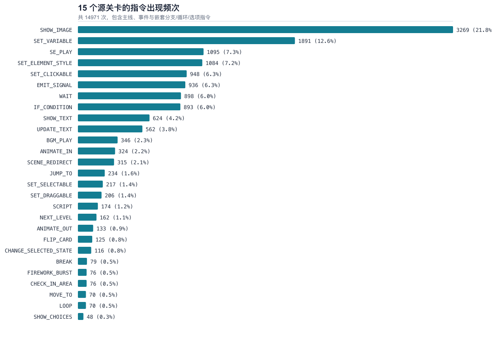
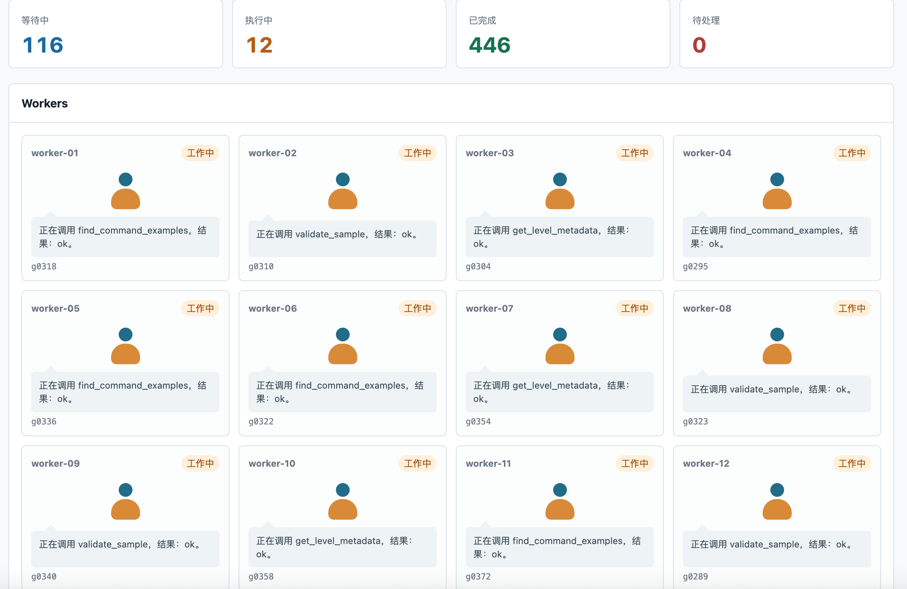
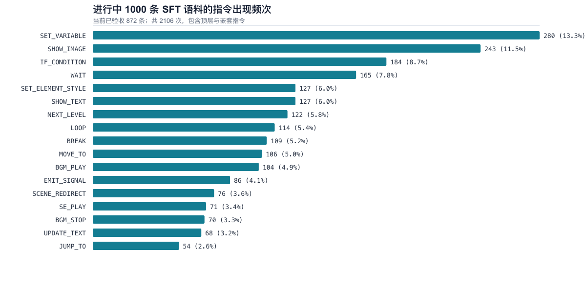

# 游戏指令训练数据合成策略

本文记录 Vibe Game Engine 的指令模型训练数据从人类关卡到增强语料的完整方法。目标不是让模型复述某一关的 JSON，而是让它在一个已经创建好的空白关卡中，根据用户需求输出可执行、可验证的指令集合。

## 结论概览

- **高质量人类基座**：`customer-demo/scene/` 中 15 个内容场景、135 个已试玩关卡，是语义、资源和真实事件协作的唯一事实来源。
- **一期**：生成 1,000 个紧凑的“中文需求 -> commands”样本。模型只可通过受限工具读取真实示例、上下文和资源；只有本地验收通过的记录才写入统一语料。
- **二期**：不重复一期的短指令，而是补齐两类结构性缺口：`300` 条完整跨事件协同样本，以及建议 `360` 条浏览器/Pixi 交互样本。
- **分布驱动**：每轮结束后必须重新运行统计脚本，以原始 15 场景的真实频率为参照调整下一轮配额，而不是机械追求指令均匀分布。

## 1. 人类数据基座

训练锚点为 15 个内容丰富的游戏场景：

`记忆衣橱、速记消除战、药品规划家、小笼包派对、各就各位、药片领航员、手疾眼快、谁知盘中餐、瓜果分类、顺序记忆师、农具速记、虫虫大作战、服药小管家、老火锅记忆、小小药剂师`。

每个场景有 9 个关卡，共 **135** 关。这些关卡由人类创建并实际试玩通过，因此它们是运行时语义、真实资源引用、事件组织和交互组合的权威来源。入口页和菜单页不纳入统计或训练分布基线。

`agent-debugger/build_command_db.py` 将场景拆为只读 SQLite 索引，包含：

- 指令实例与所属主线/事件流；
- 嵌套的条件分支、循环体和选项回调；
- 相邻指令上下文；
- 关卡尺寸、真实资源 `id/type/path` 与磁盘存在性；
- 事件标识和基础关卡元数据。

教师模型从不直接获得整份场景 JSON，也不应把关卡名、关卡编号、资源路径写入用户意图。场景只用于检索语法证据和可用资源；输出意图始终描述“当前空白关卡”的用户请求。

## 2. 原始关卡分布

统计口径：计入主线、事件和嵌套的条件分支/循环/选项回调中的每一次指令出现。15 个场景共计 **14,971** 次指令、**27** 种类型。



仓库内的权威图表与明细在：

- [频次图 SVG](../training-data/command-distribution/command-frequency.svg)
- [频次 CSV](../training-data/command-distribution/command-frequency.csv)
- [完整统计 JSON](../training-data/command-distribution/command-frequency.json)

| 排名 | 指令 | 次数 | 占比 | 15 场景覆盖 |
| ---: | --- | ---: | ---: | ---: |
| 1 | `SHOW_IMAGE` | 3,269 | 21.8% | 15/15 |
| 2 | `SET_VARIABLE` | 1,891 | 12.6% | 15/15 |
| 3 | `SE_PLAY` | 1,095 | 7.3% | 15/15 |
| 4 | `SET_ELEMENT_STYLE` | 1,084 | 7.2% | 15/15 |
| 5 | `SET_CLICKABLE` | 948 | 6.3% | 15/15 |
| 6 | `EMIT_SIGNAL` | 936 | 6.3% | 15/15 |
| 7 | `WAIT` | 898 | 6.0% | 15/15 |
| 8 | `IF_CONDITION` | 893 | 6.0% | 15/15 |
| 9 | `SHOW_TEXT` | 624 | 4.2% | 15/15 |
| 10 | `UPDATE_TEXT` | 562 | 3.8% | 15/15 |

值得注意的是，事件流为 6,809 次、嵌套命令为 6,847 次、主线顶层指令仅为 1,315 次。真实关卡不是“线性命令列表”的集合，事件并行、信号路由和条件嵌套是主要结构。

## 3. 一期：可执行紧凑指令语料

一期的目标是建立高精度的基本映射能力：一个中文需求对应一条原子指令或一个紧凑的 2-4 指令 motif。它不尝试直接生成完整游戏关卡。

### 3.1 队列与教师模型

一期由 `agent-debugger/task_queue.py` 执行。每一个课程槽位是一个 SQLite 任务：worker 从队列领取任务，调用教师模型，返回候选记录；**只有控制器**串行写入 `training-data/command-agent-sft/corpus.jsonl`，worker 从不并发抢写语料文件。



当前工程支持多端点粘性分配和故障切换。该轮使用的教师模型为：

- **Grok 4.5**
- **GPT-5.6 Terra**

端点、模型、超时、重试、token 上限及 `VIBE_TEACHER_MAX_ACTIONS` 来自 `agent-debugger/.env`，文件修改后在**下一次教师 API 调用**热加载。`--workers` 是进程启动时创建的线程数，修改它必须重启队列。Python 提示词和验证器同样在启动时导入，代码变更需重启后生效。

队列状态、尝试次数、worker 进度和事件日志保存在 `agent-debugger/runs/command-agent/task-queue.sqlite`。写入语料后会 `flush + fsync`，且队列启动时会自动截断唯一可能由强制杀进程造成的末尾半行 JSON；上次处于 `running` 的任务会重新回到队列。因此可以停止并重启，不会丢弃已完整落盘的训练记录。

### 3.2 单任务合成与验收

每个任务遵循以下受限流程：

```text
课程槽位
  -> get_command_contract
  -> find_command_examples / get_command_context / get_level_metadata（按需）
  -> 生成候选 commands
  -> validate_sample
  -> 控制器本地验收
  -> 单控制器串行写入 corpus.jsonl
```

有效候选必须同时满足：

- 指令类型和参数符合实际运行时契约；
- 使用资源时，`asset_catalog` 的 `id/type/path` 必须与检索到的关卡元数据一致，且文件存在；
- `MOVE_TO`、`UPDATE_TEXT`、`SET_ELEMENT_STYLE` 等元素依赖必须在同一 motif 中先创建元素；
- `BREAK` 只能位于 `LOOP.commands`；
- `IF_CONDITION` 必须使用运行时实际识别的 `condition`、`trueCommands`、`falseCommands`。变量条件必须使用 `key/operator/value`，拒绝会被运行时忽略的 `then/else/thenCommands/elseCommands/variable/left/right` 等伪字段；
- 最终交给真实 `CommandExecutor` 配合内存状态、资源、渲染和音频适配器 dry-run。

达到行动上限但最终验证失败的候选**绝不写入** `corpus.jsonl`：任务会重试，达到 `--max-attempts` 后仅保留失败日志。这个规则保证“重试失败”不是训练标签。

一期仅覆盖能由无浏览器 dry-run 验证的 17 种直接运行时指令。浏览器/Pixi 专有交互指令被有意隔离，避免在没有交互运行器时把表面合法但实际不可玩的 JSON 写入训练集。

### 3.3 Teacher-model agent loop、工具与验证器

这不是一个让教师模型自由读取仓库、自由写文件的 coding agent。它是一个**受约束的证据检索与候选生成 loop**：模型选择需要什么证据、构造候选并请求校验；控制器掌握真实 DSL、资源边界、执行和最终写入权。换言之，模型不能“宣称正确”就使样本入库。

每一次工具调用都必须携带简短的事实性 `decision`：`goal`、`evidence`、`hypothesis`、`verification`。它用于审计模型选择依据，不要求或保存长篇推理过程。每个已验收记录都保存 `tool_trace`、用到的 `source_examples`、验证结果及计划槽位，训练 formatter 可只取最终 `input/output`，不把工具过程混入监督答案。

#### 一期工具面

| 工具 | 模型能得到什么 | 约束与用途 |
| --- | --- | --- |
| `get_command_contract(command_type)` | 某个一期支持指令的必要字段、前置条件和简短说明 | 必须先读取所分配的主指令契约；控制器据此拒绝没有契约证据的最终候选。 |
| `find_command_examples(command_type, query, limit)` | 真实场景中最多 10 个紧凑指令实例 | 用来确认字段名称和引擎习惯，不是把某个实例逐字复制到训练集。 |
| `get_command_context(command_key, before, after)` | 目标指令前后最多各 10 条同流指令 | 当顺序、元素创建、循环或分支依赖有意义时使用。 |
| `get_level_metadata(level_key)` | 画布、事件摘要和该关真实资源目录 | 只有从这里暴露出的资源才可进入 `asset_catalog`；不能臆造路径或虚拟资源。 |
| `validate_sample(sample)` | 命令验证器的结构、依赖和 dry-run 结果 | 失败后模型应依据错误修订；验证通过后控制器直接验收，避免额外一次无意义的 `finish` 调用。 |
| `finish(sample)` | 兼容的显式最终验收入口 | 仍检查“主指令契约已读取”并再次验证；有些 provider 会直接返回 JSON，控制器也会走相同本地验收。 |

教师 API 可以是 OpenAI 工具调用、JSON envelope 或 Anthropic Messages 格式，控制器会规范化为同一套工具结果。一个 completion 中即使返回多个调用，也只执行一个，再把结果反馈给模型，确保行动次数、证据和失败原因可观测。默认上限由 `VIBE_TEACHER_MAX_ACTIONS` 热加载，本轮设为 `20`；达到上限后控制器只额外请求一次“不再调用工具、仅输出最终 JSON”的回答，并重新走完整验收。最终仍不通过则失败重试，不会放宽门槛。

```text
教师模型：读取契约 -> 按需检索真实证据 -> 提交候选 -> 读取验证错误 -> 修订
                                      |                                      |
                                      +----------- 控制器执行工具 -----------+
                                                             |
                           通过 CommandSampleValidator + CommandExecutor dry-run
                                                             |
                                      单控制器 fsync JSONL -> SQLite 标记 done
```

#### 验证器 A：紧凑可执行指令验证器

`agent-debugger/command_validator.py` 中的 `CommandSampleValidator` 是一期写入前的硬门。它的检查分层如下：

1. **样本形状**：中文意图、`commands` 数量、主指令必须出现、每条命令有唯一 ID、类型必须是当前一期允许的直接运行时类型，且每个 `parameters` 是对象。
2. **参数与递归结构**：必填字段、循环体、选项回调、条件分支的嵌套命令都会遍历；`BREAK` 只能嵌套在 `LOOP.commands` 中。
3. **运行时语义对齐**：元素引用必须先由 `SHOW_IMAGE` 或 `SHOW_TEXT` 创建；`IF_CONDITION` 的变量条件必须为 `key/operator/value`，并使用 `trueCommands/falseCommands` 数组。这样可以拒绝运行时虽不报 JSON 错、却会静默忽略的别名字段。
4. **资源真实性**：递归扫描所有资源引用；资源必须在 `asset_catalog` 声明、已由 `get_level_metadata` 暴露、类型与字段匹配、路径与项目元数据一致并且磁盘存在。`virtual://`、占位资源和猜测路径不允许进入一期。
5. **实际执行**：`runtime_dry_run.js` 通过 TypeScript 的真实 `CommandExecutor` 和已注册 handlers 执行候选。它用内存状态、资源、渲染、事件和音频适配器替代 DOM/音频设备，且不真实等待计时器。任何 handler 失败、输出非 JSON、超时或资源解析失败都会令验证失败。

此验证器的边界同样明确：它只能覆盖不依赖 Pixi DOM 输入的指令，不能证明点击、拖拽、选择或真正动画画面能被用户完成。因此浏览器/Pixi 指令在一期被拒绝并转入二期轨道 B，而不是被“兼容性放行”。

#### 验证器 B：跨事件协同验证器

`agent-debugger/event_coordination_validator.py` 中的 `EventCoordinationValidator` 面向完整的 `{commands, extra_events}` 输出。它有两种模式：

| 模式 | 适用对象 | 未在当前输出中创建的依赖 |
| --- | --- | --- |
| `complete_patch` | 二期新建的、可独立插入的跨事件补丁 | 作为**错误**；样本必须自包含。 |
| `level_context` | 已有人工场景或一期历史 corpus 的审计 | 作为**警告**；依赖可能已存在于当前关卡的其他部分。 |

严格的 `complete_patch` 会检查：

- `commands` 和 `extra_events` 的外形，事件的 `id/name/triggers/commands` 完整性，以及事件和命令 ID 全局唯一；
- 支持的触发器字段：`custom.target` 必须是非空 signal，`auto` 必须是 `start: immediate`；
- 每个 `EMIT_SIGNAL` 与 custom listener 的双向连通性，避免发了无人监听的信号或监听永远不会触发的事件；
- 所有主线、事件和嵌套命令的类型、必填字段、条件分支、资源类型/路径；
- 元素及父元素先创建后引用、变量先初始化后静态读取、循环必须有可更新条件的有界退出；
- 已声明 existing 资源必须在 `customer-demo/` 中实际存在。

该验证器验证的是事件图、静态依赖和运行时字段契约，不等价于完整的浏览器试玩。因此二期跨事件样本还要求实际运行时回放抽检；浏览器交互轨道则必须先拥有专用运行器，才允许生成和入库。

#### 控制器写入与失败语义

只有 `run_job()` 返回带有 `accepted: true` 验收结果的 record，任务队列控制器才会在锁内追加 JSONL、`flush + fsync`，然后将 SQLite task 标为 `done`。写入前还会根据 `sample_fingerprint` 去重。验证失败、重复 fingerprint、API 失败、上限后的最终失败都只更新任务错误和尝试次数；达到重试上限后标为 `failed`，没有任何失败候选会被混入训练语料。

## 4. 一期进行中分布快照

下面是当前运行中 corpus 的快照统计，只计 `gxxxx` 课程计划记录。该数字会随队列写入变化，不能替代一期结束后的最终复跑结果。



本次快照为 **872** 个已验收样本、**2,106** 次指令、**17** 种类型，其中 1,753 次顶层指令和 353 次嵌套指令。明细见 [CSV](../training-data/command-distribution/sft-command-frequency.csv) 与 [JSON](../training-data/command-distribution/sft-command-frequency.json)。

| 指令 | 原始关卡占比 | 一期快照占比 | 差异解释 |
| --- | ---: | ---: | --- |
| `SHOW_IMAGE` | 21.8% | 11.5% | 图像展示在真实关卡中占比很高，一期相对偏低。 |
| `SET_VARIABLE` | 12.6% | 13.3% | 接近基线，略高。 |
| `IF_CONDITION` | 6.0% | 8.7% | motif 中条件门槛较多，偏高但合理。 |
| `WAIT` | 6.0% | 7.8% | 展示/反馈 motif 拉高。 |
| `EMIT_SIGNAL` | 6.3% | 4.1% | 未覆盖完整事件配置，偏低。 |
| `SE_PLAY` | 7.3% | 3.4% | 真实反馈音效比例未覆盖充分。 |
| `SET_CLICKABLE` | 6.3% | 0% | 浏览器/Pixi 专用，未进入一期。 |
| `ANIMATE_IN` | 2.2% | 0% | 浏览器/Pixi 专用，未进入一期。 |
| `SET_SELECTABLE` | 1.4% | 0% | 浏览器/Pixi 专用，未进入一期。 |
| `SET_DRAGGABLE` | 1.4% | 0% | 浏览器/Pixi 专用，未进入一期。 |
| `SHOW_CHOICES` | 0.3% | 0% | 尚未建立选择交互运行器。 |

一期中 `LOOP`、`BREAK`、`MOVE_TO`、`NEXT_LEVEL` 和 `BGM_STOP` 比原始关卡基线更高，是课程模板为了练习依赖、退出和生命周期而进行的有意识过采样。它们不需要被压回原始占比；二期的任务是补齐完全缺失的交互与跨事件结构，不是简单把所有指令调成相同数量。

## 5. 二期：补齐计划，不与一期混写

二期必须等一期队列结束、最终 corpus 审计完成后再启动。二期数据使用统一输出外形：

```json
{
  "commands": ["当前主线新增的指令"],
  "extra_events": ["完整的 EventConfig 数组；无跨事件需求时为空数组"]
}
```

### 5.1 轨道 A：跨事件协同，300 条

已生成但尚未并入训练管线的 `training-data/event-coordination-sft-v2.json` 含 **300** 个完整、自包含的跨事件样本，并已由 `agent-debugger/event_coordination_validator.py` 静态验证 300/300 通过。它包含：

| 主题 | 建议/已生成数 | 主要能力 |
| --- | ---: | --- |
| 并行倒计时 HUD | 45 | `EMIT_SIGNAL + LOOP + WAIT + UPDATE_TEXT` |
| 背景音乐生命周期 | 35 | 自动事件开始、`BGM_PLAY/BGM_STOP` |
| 背景循环动画 | 35 | 独立事件不阻塞主线 |
| 分数变化反馈 | 45 | 状态改变后事件刷新与音效 |
| 连续错误帮助 | 40 | 条件触发与一次性提示 |
| 高分庆祝 | 30 | 条件触发、音效、粒子反馈 |
| 阶段状态跳转 | 25 | 变量门槛与下一关 |
| 主线 + 并行 + 条件三方协同 | 45 | 多事件、信号和共享状态 |

这条轨道针对 `EMIT_SIGNAL` 偏低和“用户需求需要跨事件协同”这一真实建模能力。它的严格验证器检查事件/命令 ID 唯一性、信号发射与监听连通性、事件触发器字段、元素和变量依赖、资源类型与路径、条件分支及有界循环。将其格式化并入训练集前，仍需做一次浏览器运行时回放抽检。

### 5.2 轨道 B：浏览器/Pixi 交互，建议 360 条

一期中完全为零但在 15 个真实场景中反复出现的交互指令，不能由当前内存 dry-run 证明。先实现浏览器/Pixi 专用运行器和人工试玩抽检，再按下面的目标配额生成。配额按真实频率、场景覆盖和组合复杂度确定，不把 `SCRIPT` 作为可学习的任意代码能力。

| 类别 | 样本数 | 重点组合 |
| --- | ---: | --- |
| `SET_CLICKABLE` | 90 | 图片/文本创建 -> 点击 -> 变量或信号反馈 |
| `ANIMATE_IN` | 45 | 元素创建 -> 入场动画 -> 主线继续 |
| `SET_SELECTABLE` | 35 | 选择状态 -> 选中变化 -> 条件/计分 |
| `SET_DRAGGABLE` | 30 | 拖拽元素 -> 区域检测 -> 正误反馈 |
| `ANIMATE_OUT` | 25 | 反馈完成 -> 退场/清理 -> 下一步 |
| `FLIP_CARD` | 25 | 卡牌创建 -> 翻转 -> 匹配状态 |
| `CHANGE_SELECTED_STATE` | 25 | 多选状态切换 -> 确认反馈 |
| `CHECK_IN_AREA` | 20 | 拖拽落区 -> 变量/信号结果 |
| `FIREWORK_BURST` | 20 | 达标庆祝，与条件/音效联动 |
| `SHOW_CHOICES` | 15 | 选项 -> 回调命令 -> 分支状态 |
| 综合交互场景 | 30 | 点击/选择/拖拽与事件协同的 3-6 指令块 |
| **合计** | **360** | |

`SCRIPT` 在原始关卡中出现 174 次，但它的语义是任意脚本而不是稳定的 DSL 原语；二期不扩充它。若未来必须支持，应另建白名单脚本子语言、静态检查和沙箱，而不是把原脚本直接作为 SFT 标签。

### 5.3 二期启动门槛

1. 一期队列完成，最终 `corpus.jsonl` 审计通过，历史错误条件分支已修复或剔除。
2. 将一期所有输出统一为 `{commands, extra_events: []}`，但不在一期运行中原地改写。
3. 浏览器/Pixi 运行器能对轨道 B 的每类指令回放关键交互；每个组合族至少人工试玩抽检。
4. 跨事件样本在事件验证器和实际运行时都通过后，才与一期紧凑语料以明确版本字段混合。
5. 重新生成两张分布图，并对照本节配额判断是否需要第三期，而非依据单个命令绝对次数判断。

## 6. 复跑与更新

场景或语料变化后，运行以下命令刷新统计：

```bash
cd /Users/pippo/github-repo/vibe-game-engine

# 15 个高质量人类场景的基线
python3 agent-debugger/analyze_command_distribution.py

# 当前或最终一期 SFT 语料快照
python3 agent-debugger/analyze_command_distribution.py \
  --corpus training-data/command-agent-sft/corpus.jsonl
```

输出均在 `training-data/command-distribution/`。统计器对正在追加的 JSONL 末尾异常行采取跳过策略，因此不会影响运行中的队列；最终报告应在队列停止写入后再生成一次。

## 7. 数据质量原则

- 人类已试玩场景优先于模型臆测的玩法语义。
- 验证失败、达到重试上限、重复 fingerprint 的候选不进入训练语料。
- 与当前运行时不一致的字段，即使 JSON 合法也视为失败。
- 用完整事件样本教授事件协作；用 `extra_events: []` 明确标注不需要跨事件协同的普通需求。
- 训练、评估、数据版本和统计快照必须分开记录，避免把运行中数字误当成最终实验结论。
